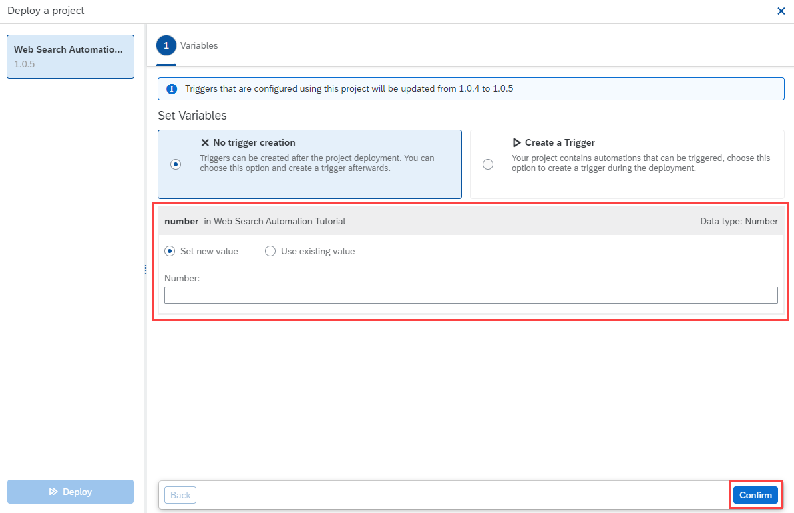

After successfully configuring  SAP SuccessFactors, we are now ready to execute these automation. 

Each automation has set of input like which SuccessFactors tenant you will be using, Automation API user credential detail etc. these values will be provided to the Automation through Environment Varialbles at the time of deployment.

> What is an Environment Variable?
> 
> You use environment variables to pass parameters to automations. You can create environment variables in the Cloud Studio for which you can later set values across specified environments.
>
> Note:
> Environment variables are called Cloud Studio variables in the Settings tab of SAP Process Automation.

For more information, kindly refer to our documentation [Page](https://help.sap.com/docs/PROCESS_AUTOMATION/a331c4ef0a9d48a89c779fd449c022e7/d73e8eee03aa4ff097a47c574774778b.html)

At the time of deployment, you will key in relevant values for the environment variables

Similar to SuccessFactors Configurations, each project contains SAP Process Automation specific configuration instructions, it will be handy when deploying these automations.