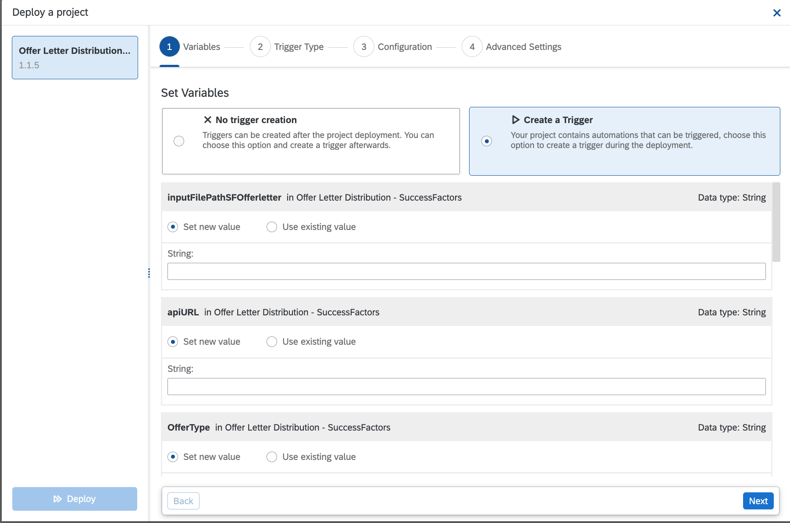

As a pre-requisite, review the SAP Process Automation configuration for **Screening Questions(API) -SuccessFactors** 

>Note
>
> In order to test the automation, you will need at least one job requisition in the appropriate state with assigned to your Automation or API Bot user as described in the SuccessFactors configuration section of PreScreening question.

You will be in need your SuccessFactors tenant specific values for the below enviroment variables 

Name | Description | Type | Sample | is it Mandatory?
------------ | ------------ | ------------ | ------------| ------------
apiURL| [API URL of SuccessFactors (see KBA 2215682)](https://userapps.support.sap.com/sap/support/knowledge/en/2215682) |String | [https://apisalesdemo4.successfactors.com:443/odata/v2](https://apisalesdemo4.successfactors.com/odata/v2)| Required
sfuser| Bot user username and password |Credential | botuser/password| Required
companyId| CompanyID of the SuccessFactors instance |String | SFTenantName| Required
completedComment| Comment to be added when moving the job requisition tot he next step |String | SPA Automation added prescreen questions| Required
questionObject| Question object external code |String | cust_REC_Questions| Required
questionObject| Question group object external code |String | cust_REC_QuestionGrouping| Required
stepName| Bot step in the job requisition route map |String | Bot inbox step| Required
outputFolderPath| Folder Path to save bot execution logfile |String | C:\Temp| Optional
logEmail| Email that will receive bot execution logs |String | [sfadminEmail@bestRunSAP.com](mailto:sfadminEmail@bestRunSAP.com)| Optional

#### 1. Start Deployment
1. From the project screen, click the Deploy button

#### 2. Deploy Automation & Configure variables

#### 3. Configure Trigger Type

#### 4. Define Automation Execution Schedule

#### 5.  Confirm & Deploy

Based on your trigger type, the automation will be triggered in either attended or scheduled mode.

At the end of each execution, bot will prepare a log file in excel format and email to the configured recepient at the time of deployment.

Outlook Screen Grab

#### Excel Based Log

