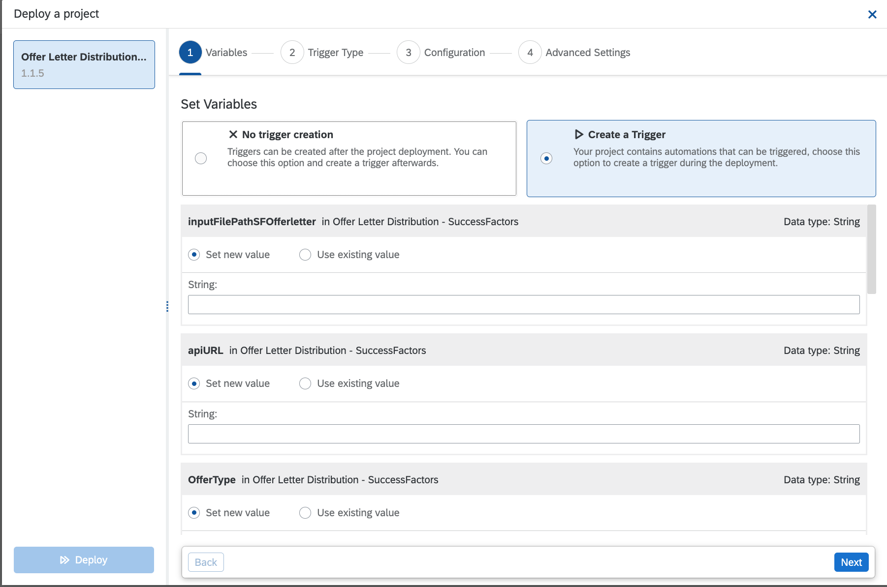
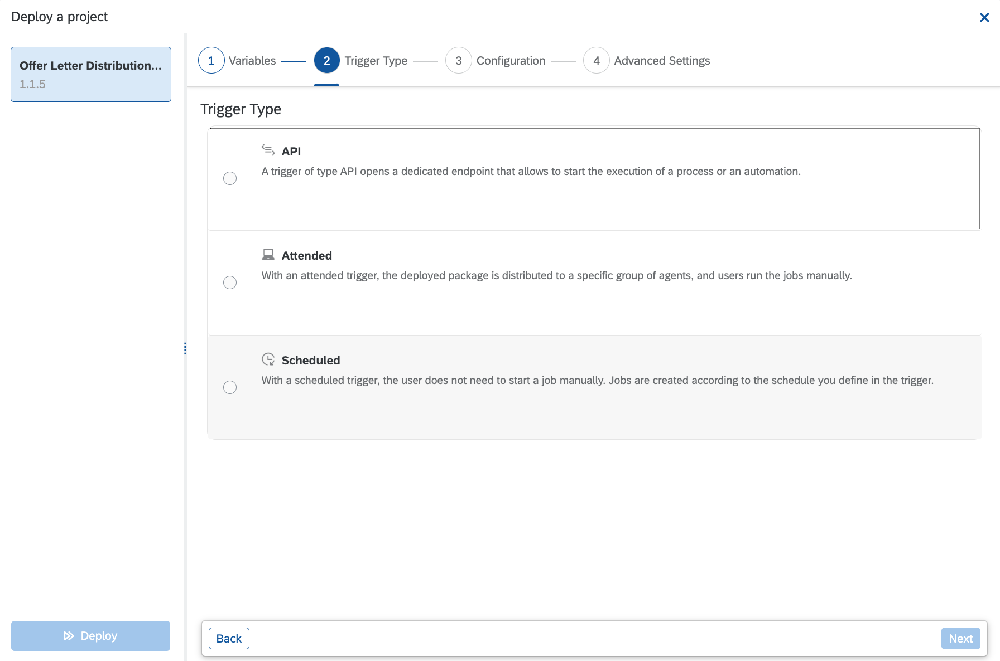
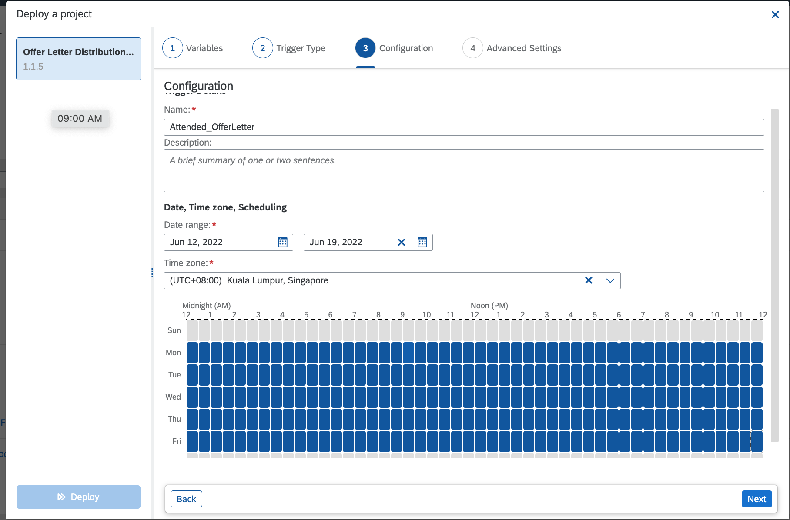
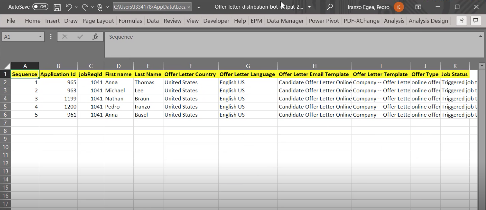

As a pre-requisite, review the SAP Process Automation configuration for  **Offer Letter Distribution - SuccessFactors**

>Note
>
> In order to test the automation, you will need at least one job requisition in the appropriate status = Offer, and Substatus = Read to offer for automation to identify that it needs to roll out the offer letter. This is as per the SuccessFactors configuration guide previously explained.

You will be in need your SuccessFactors tenant specific values for the below enviroment variables 

Name | Description | Type | Sample | is it Mandatory?
------------ | ------------ | ------------ | ------------| ------------
apiURL| [API URL of SuccessFactors (see KBA 2215682)](https://userapps.support.sap.com/sap/support/knowledge/en/2215682) |String | [https://apisalesdemo4.successfactors.com:443/odata/v2](https://apisalesdemo4.successfactors.com/odata/v2)| Required
botuser| Bot user username and password |Credential | botuser/password| Required
companyId| CompanyID of the SuccessFactors instance |String | SFTenantName| Required
botStep| Applicant status where candidates will be placed to be picked up by the bot |String | Request Offer Letter| Required
OfferType| Offer type the bot will send. Options are: 1) Online offer (2) Verbal offer (3) Email as text (4) Email as PDF attachment |String | SPA Automation added prescreen questions| Required
sfurl| SuccesFactors application URL |String | [https://salesdemo4.successfactors.com/](https://salesdemo4.successfactors.com/)| Required
outputFolderPath| Folder Path to save bot execution logfile |String | C:\Temp| Optional
logEmail| Email that will receive bot execution logs |String | [sfadminEmail@bestRunSAP.com](mailto:sfadminEmail@bestRunSAP.com)| Optional
inputFilePathSFOfferLetter| Input File Path (Only required when you are triggering SF_Offer_Letter_UI_Only_Start Automation) |String | C:\Temp\Input| Optional
#### 1. Start Deployment

From the project screen, click the Deploy button

#### 2. Deploy Automation & Configure variables

#### 3. Configure Trigger Type

#### 4. Define Automation Execution Schedule

#### 5.  Confirm & Deploy

Based on your trigger type, the automation will be triggered in either attended or scheduled mode.

At the end of each execution, bot will prepare a log file in excel format and email to the configured recepient at the time of deployment.

Excel Based Log

