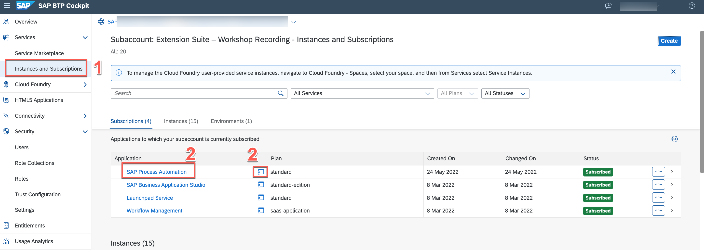
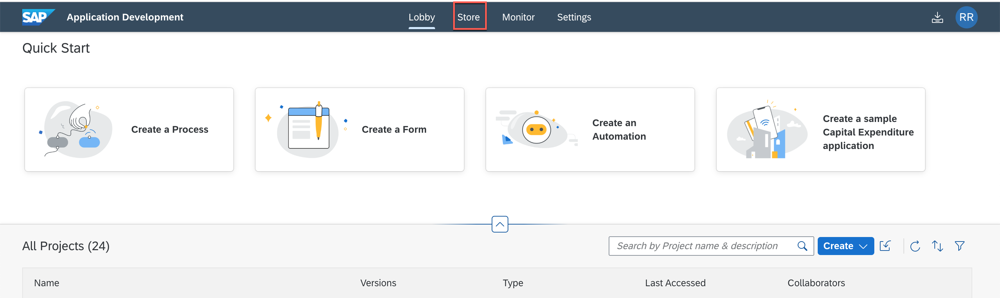
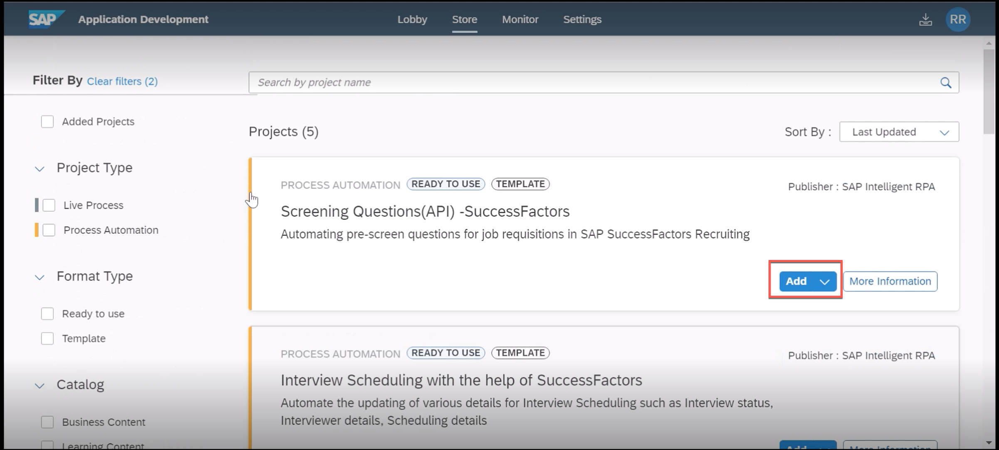
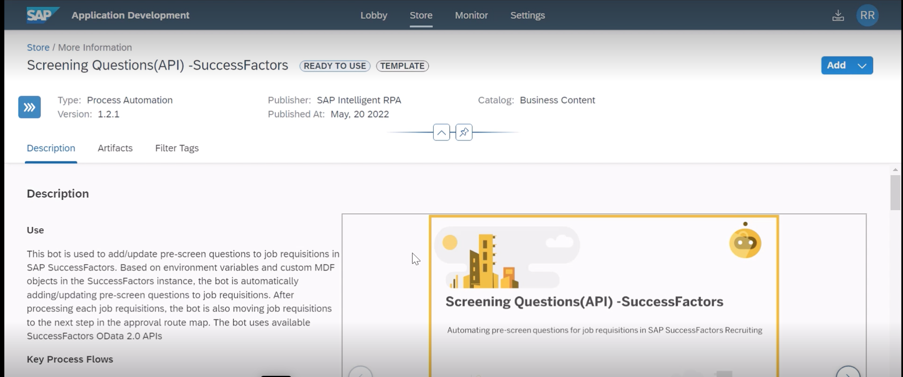
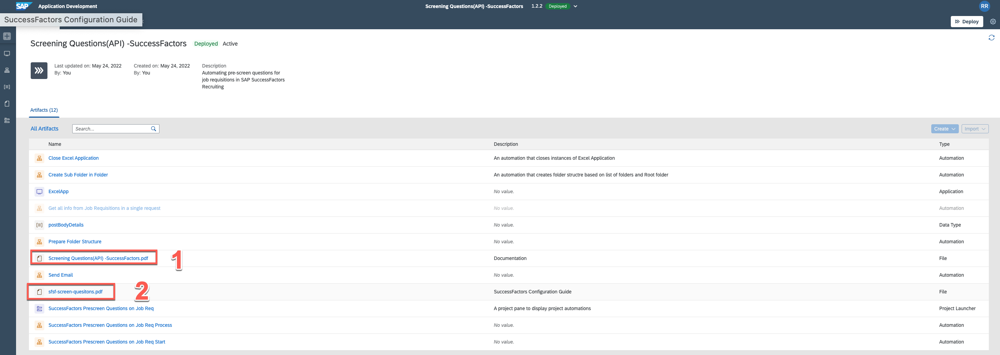
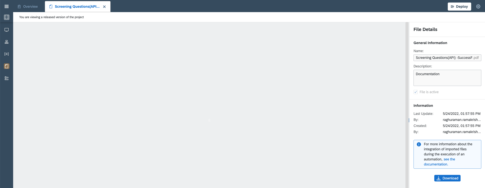

In the next series of tasks, you will download the automations from the SAP Process Automation Store and execute them. 

>What is SAP Process Automation Store?
>
   The Store is available for everyone and can be accessed directly from the SAP Process Automation product home page within the product. The store offers prebuilt content created and curated by SAP which can be used free of charge with SAP Process Automation. Any automations built by SAP Partners and accessed through the store will have to be purchased as per the invidiual automations terms and conditions laid out in SAP Store & by the SAP Partner. The store also offers a variety of filters, a search feature, and content descriptions to help users find what they are looking for quickly.
>
> For more information, please refer to our documentation [page](https://help.sap.com/docs/PROCESS_AUTOMATION/527c579a1cba4f12b45326c8e890d102/8324854ae0ba400296ee384d35f95235.html?locale=en-US)

Explore the store as described in the documentation page [Explore the Store | SAP Help Portal](https://help.sap.com/docs/PROCESS_AUTOMATION/527c579a1cba4f12b45326c8e890d102/b38897b821874ebe98fb15fc7d4400e9.html?locale=en-US))

Instructions to download Automations from SAP Process Automation Store

1. From your Sub account, go to Instances and Subscriptions menu (1),
2. Launch SAP Process Automation (2) by clicking the name or the icon beside it

3. From the SAP Process Automation Lobby, Navigate to SAP Process Automation Store

4. Filter Products to SAP SuccessFactors and locate both the automations. You can click the **Add** button. 

5. You can also review the description by clicking **More Information**  and details about the automations and click the Add button with in the Automation details page.

6. After few seconds downloaded project is accessible from the lobby, Like other Store content, each project consists of relevant screen captures, automations, templated excel files (if applicable) and relevant configuration documentations and other general documentations. 
7. From within the project we will explore the files it contains, locate the SuccessFactors Configuration file (1) and SAP Process Automation Configuration files and download it from the detail page to your local computer.

8. Download from the details page

9. Repeat the same step for SuccessFactors Configuration guide.
10. Repeat the steps from **Step 3** and download offer letter automation related project from the store, and later download the SAP Process Automation Configurations & Success Factors Configuration for offer letter distribution.