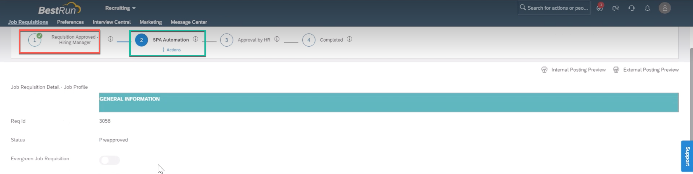
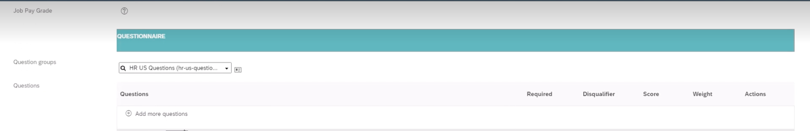

The required SuccessFactors configurations to get started with Pre Screen Questions Automation is provided as part of the Store project of **Screening Questions(API) -SuccessFactors** 

In the previous task you download the automations from the store and downloaded the required configurations files too.

Just follow the SuccessFactors Configurations as per the documentation provided.

Once SAP SuccessFactors Components (API User, Business Rules, MDF Objects , Question Group / Question Objects and finally sample data) are created, you can create a Job requisition. 

You will be needing the below values at the time of running your automations. so have them handy esp question group object and question object for which you created sample values. 

>Note:
>Please create sample requisition per your tenant configuration either using Basic Job Requisition template or Standard Job Requisition Template. 

Name | Description | Type | Sample | is it Mandatory?
------------ | ------------ | ------------ | ------------| ------------
apiURL| [API URL of SuccessFactors (see KBA 2215682)](https://userapps.support.sap.com/sap/support/knowledge/en/2215682) |String | [https://apisalesdemo4.successfactors.com:443/odata/v2](https://apisalesdemo4.successfactors.com/odata/v2)| Required
sfuser| Bot user username and password |Credential | botuser/password| Required
companyId| CompanyID of the SuccessFactors instance |String | SFPART012345| Required
questionObject| Question object external code |String | cust_REC_Questions| Required
questionObject| Question group object external code |String | cust_REC_QuestionGrouping| Required
stepName| Bot step in the job requisition route map |String | Bot inbox step| Required

In the end, your job requisition must be assigned to the API User and will appear something like this as per the Business Rule

and the sample question groups object is attached to the job requisition.

